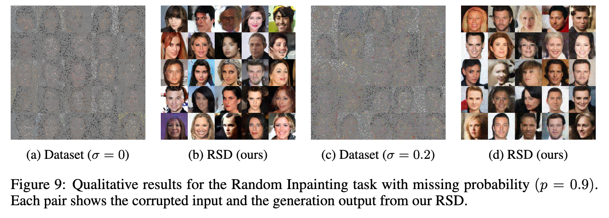

# Restoration Score Distillation (RSD)

**[ICLR 2026 Poster]** Official PyTorch implementation of:

> **Score Distillation Beyond Acceleration: Generative Modeling from Corrupted Data**  
> Yasi Zhang\*, Tianyu Chen\*, Zhendong Wang, Ying Nian Wu, Mingyuan Zhou, Oscar Leong  
> (\* Equal contribution)  
> [arXiv:2505.13377](https://arxiv.org/abs/2505.13377) | [OpenReview](https://openreview.net/forum?id=ROGCckKICU)

---

## Overview

RSD is a two-stage framework for training efficient one-step generative models **without any clean training data**. Given only corrupted observations (e.g., noisy images), RSD:

1. **Stage 1 — Teacher Pretraining:** Trains a corruption-aware diffusion model directly on the degraded measurements.
2. **Stage 2 — Score Distillation:** Distills the teacher into a one-step generator by aligning score functions via a Fisher divergence loss, achieving both faster inference and improved sample quality.

RSD generalizes to a broad class of forward operators including Gaussian denoising, random inpainting, super-resolution, and MRI reconstruction.

---

## Results

### Noisy Image Generation (Gaussian noise, σ=0.2)

| Dataset | Teacher (Truncated) FID | **RSD (1-step) FID** |
|---------|------------------------|----------------------|
| CIFAR-10 | 12.21 | **4.77** |
| CelebA-HQ | 13.90 | **6.48** |

### CIFAR-10 Across Noise Levels

| Noise σ | Teacher-Full | Teacher-Truncated | RSD |
|---------|--------------|-------------------|-----|
| 0.1 | 25.55 | 7.55 | **3.98** |
| 0.2 | 60.73 | 12.21 | **4.77** |
| 0.4 | 124.28 | 22.12 | **21.63** |

### Full Metrics (CIFAR-10, σ=0.2)

| Metric | Teacher | RSD |
|--------|---------|-----|
| FID ↓ | 12.21 | **4.77** |
| IS ↑ | 8.31 | **9.16** |
| Precision ↑ | 0.59 | **0.65** |
| Recall ↑ | 0.41 | **0.56** |

### Random Inpainting (CelebA-HQ, noiseless)

| Missing Rate | Teacher FID | RSD FID |
|-------------|-------------|---------|
| 60% | 6.08 | **4.44** |
| 80% | 11.19 | **7.10** |
| 90% | 25.53 | **16.86** |



### Multi-coil MRI Reconstruction (FastMRI)

| Acceleration | L1-EDM | Teacher | RSD |
|-------------|--------|---------|-----|
| R=2 | 18.55 | 30.34 | **12.95** |
| R=4 | 27.64 | 32.31 | **10.71** |
| R=6 | 51.43 | 31.50 | **14.64** |
| R=8 | 102.98 | 48.15 | **22.51** |

**Sampling speedup:** ~30× faster than the teacher (50k samples in ~20 sec vs. ~10 min on CIFAR-10).

---

## Pretrained Models

Coming soon — pretrained checkpoints for CIFAR-10, FFHQ, CelebA-HQ, and AFHQ will be released on HuggingFace.

---

## Installation

```bash
conda env create -f environment.yml
conda activate rsd
```

---

## Repository Structure

```
RSD/
├── train.py              # Stage 1: pretrain corruption-aware teacher
├── rsd_train.py          # Stage 2: RSD distillation into one-step generator
├── scripts/              # Utility scripts
│   ├── generate.py           # EDM sampling from teacher
│   ├── rsd_generate.py       # One-step generation from RSD model
│   ├── rsd_generate_onestep.py
│   ├── eval_fid.py           # FID evaluation
│   ├── fid.py
│   ├── dataset_tool.py       # Dataset preprocessing
│   └── rsd_metrics.py        # FID/IS/Precision/Recall metrics
├── run_bash/             # Training and evaluation scripts
│   ├── pretrain.sh           # Stage 1 (all datasets)
│   ├── distill.sh            # Stage 2 (all datasets)
│   ├── inference.sh          # Generate from teacher
│   ├── evaluate.sh           # Compute FID
│   └── generate_rsd.sh       # One-step generation
├── training/             # Core training modules
├── metrics/              # Evaluation metrics
├── ambient_utils/        # Dataset and utility functions
├── torch_utils/          # Distributed training utilities
└── dnnlib/
```

---

## Dataset Preparation

Use `scripts/dataset_tool.py` to convert datasets into ZIP format at the desired resolution.

**FFHQ (64×64)**
```bash
python scripts/dataset_tool.py --source=/path/to/ffhq/images \
    --dest=/path/to/ffhq-64x64.zip --resolution=64x64
```

**CelebA-HQ (64×64)**
```bash
python scripts/dataset_tool.py --source=/path/to/celeba_hq/images \
    --dest=/path/to/celeba_hq-64x64.zip --resolution=64x64
```

**AFHQ-v2 (64×64)**
```bash
python scripts/dataset_tool.py --source=/path/to/afhqv2/images \
    --dest=/path/to/afhqv2-64x64.zip --resolution=64x64
```

**CIFAR-10 (32×32)**
```bash
python scripts/dataset_tool.py --source=cifar10 \
    --dest=/path/to/cifar10-32x32.zip
```

FID reference statistics can be downloaded from the [EDM release](https://nvlabs-fi-cdn.nvidia.com/edm/fid-refs/).

---

## Training

Before running, set the dataset paths at the top of `run_bash/pretrain.sh` and `run_bash/distill.sh`.

### Stage 1: Teacher Pretraining

```bash
bash run_bash/pretrain.sh <dataset> [num_gpus]
# dataset: ffhq | celeba | afhq | cifar10
```

Examples:
```bash
bash run_bash/pretrain.sh ffhq 8
bash run_bash/pretrain.sh celeba 8
bash run_bash/pretrain.sh afhq 4
bash run_bash/pretrain.sh cifar10 4
```

Key parameters in `train.py`:
| Parameter | Description | Default |
|-----------|-------------|---------|
| `--sigma` | Gaussian noise std added to images | `0.2` |
| `--corruption_probability` | Fraction of images corrupted | `1.0` |
| `--dataset_keep_percentage` | Use a subset of the dataset | `1.0` |

### Stage 2: RSD Distillation

Pass the pretrained teacher checkpoint as the second argument.

```bash
bash run_bash/distill.sh <dataset> <teacher_ckpt> [num_gpus]
```

Examples:
```bash
bash run_bash/distill.sh ffhq ffhq/ffhq_pretrain/.../network-snapshot-XXXXXX.pkl 8
bash run_bash/distill.sh celeba celebahq/celebahq_pretrain/.../network-snapshot-XXXXXX.pkl 4
bash run_bash/distill.sh afhq afhq/afhq_pretrain/.../network-snapshot-XXXXXX.pkl 8
bash run_bash/distill.sh cifar10 cifar10/cifar_pretrain/.../network-snapshot-XXXXXX.pkl 4
```

Key parameters in `rsd_train.py`:
| Parameter | Description | Default |
|-----------|-------------|---------|
| `--alpha` | L2 − α·L1 loss weighting | `1.2` |
| `--tmax` | Maximum reverse diffusion step | `800` |
| `--init_sigma` | Fixed noise level during distillation | `2.5` |

---

## Inference & Evaluation

**Generate from teacher (truncated EDM sampling)**
```bash
bash run_bash/inference.sh <network_pkl> <outdir> [num_gpus]
```

**One-step generation from distilled RSD model**
```bash
bash run_bash/generate_rsd.sh <network_pkl> [outdir]
```

**Compute FID**
```bash
bash run_bash/evaluate.sh <gen_path> <ref_stats.npz> [out.json] [num_gpus]
```

---

## TODO

- [ ] Release pretrained checkpoints for noisy CelebA-HQ, FFHQ, and AFHQ
- [ ] Release code and checkpoints for general operator (deblurring, super-resolution)
- [ ] Release code and checkpoints for random masking operator (inpainting)
- [ ] Release code and checkpoints for MRI operator (FastMRI reconstruction)

---

## Citation

```bibtex
@inproceedings{zhang2026rsd,
  title={Score Distillation Beyond Acceleration: Generative Modeling from Corrupted Data},
  author={Zhang, Yasi and Chen, Tianyu and Wang, Zhendong and Wu, Ying Nian and Zhou, Mingyuan and Leong, Oscar},
  booktitle={International Conference on Learning Representations},
  year={2026}
}
```

---

## Acknowledgements

This codebase builds upon [EDM](https://github.com/NVlabs/edm) (Karras et al., 2022) and [RSD](https://github.com/mingyuanzhou/RSD) (Zhou et al., 2024). We thank the authors for releasing their code.
